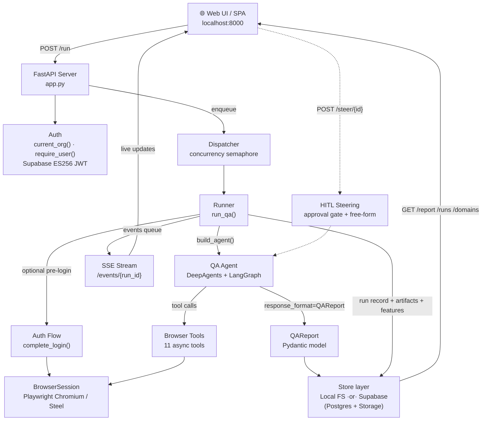
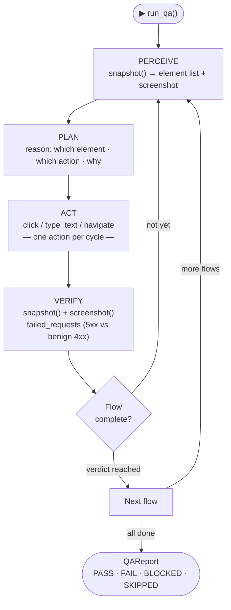
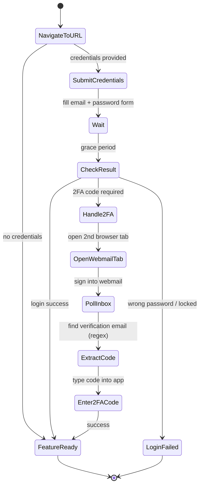
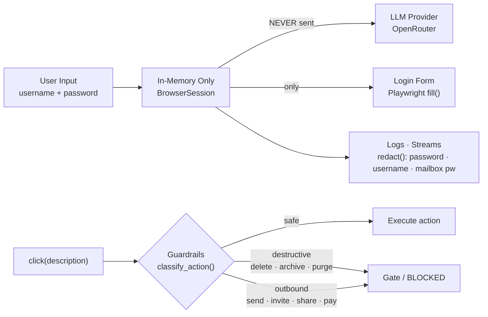

# QA Agent

> Paste a URL. Get a report. No test scripts to write.

**qa-agent** is an autonomous AI QA tester that drives a real Chromium browser, exercises your web feature through its main flows, and streams a structured, evidence-backed report — live. It runs locally as a zero-setup tool and deploys as a multi-tenant web app with accounts, persistent run history, and per-domain memory.

[](https://python.org)
[](tests/)
[](#)
[](#)
[](#)

---

## What It Does

1. You provide a URL, an optional feature brief, and optional login credentials
2. The agent navigates Chromium, snapshots the page, and plans which flows to cover
3. It works through each flow — **PERCEIVE → PLAN → ACT → VERIFY** — capturing screenshots and errors as evidence
4. A structured `QAReport` (JSON + interactive HTML, with a replayable session recording) streams back to the web UI in real time
5. You can **steer the run live** — approve risky actions or inject free-form guidance without restarting

**No test scripts. No selectors. No setup beyond `pip install`.**

---

## Features

| | |
|---|---|
| 🤖 **AI-driven testing** | LLM reasons through UI flows; one snapshot → one action → verify |
| 🔐 **Deterministic auth + 2FA** | State-machine login, not agent-driven; zero LLM spend on credentials |
| 🛡️ **Non-destructive by default** | Guardrails enforce safety at the tool layer — not in prompts |
| 🔒 **Credential isolation** | Passwords never reach the LLM provider or appear in logs |
| 🙋 **Human-in-the-loop steering** | Approve/reject risky actions at a gate, or inject free-form guidance into a live run |
| 📡 **Live streaming + live view** | SSE delivers agent steps, tool calls, and screenshots; a 4 fps MJPEG (or Steel WebRTC) feed shows the browser as it works |
| 🎥 **Replayable recording** | Every report embeds an rrweb session replay of the run |
| 👤 **Accounts & history** | Supabase auth; authenticated users get persistent run history and analytics. Anonymous demo lane stays open (rate-limited) |
| 🧠 **Per-domain memory** | Tested flows are upserted into a per-domain feature registry, so the app remembers what's been covered for each host |
| 📊 **Structured reports** | Pydantic-enforced `QAReport`: test-case verdicts, defects ranked by severity |
| 🔭 **Four-layer observability** | Console + disk artifacts + LangSmith traces + OpenRouter dashboard |
| 🎯 **Evidence required** | Every verdict must cite a screenshot, HTTP status, or console error |

---

## Architecture



**Two runtime modes**, selected automatically:

- **Local** (default, no config) — runs persist to `.runs/` on disk; single shared demo tenant.
- **Production** — when `SUPABASE_URL` + `SUPABASE_SERVICE_ROLE_KEY` are set, runs, artifacts, and the feature registry persist to Supabase Postgres + a private Storage bucket, and Supabase Auth gates per-user history.

The seam between them is `store/factory.py:build_stores()`, which picks `Local*` vs `Supabase*` implementations off `Settings.use_supabase`.

---

## The Agent Loop

The agent follows a strict **PERCEIVE → PLAN → ACT → VERIFY** cycle. Snapshot refs go stale after any interaction — the agent must re-snapshot before the next action.



**Defect attribution matters:** a 5xx counts as a defect only when it's *feature-driven* (clicking product UI, in-app navigation). A 5xx from raw `navigate()` to a hand-built deep URL is a navigation artifact, not a Fail. A 4xx is never a defect on its own (missing assets, prefetch, auth chatter are benign).

---

## Browser Tools

`build_agent()` exposes **11 async tools** to the model. Refs are per-snapshot (`s{gen}-e{idx}`) and go stale after any action.

| Tool | Purpose |
|---|---|
| `snapshot` | Enumerate visible interactive elements (ref, role, name) + screenshot; flags open overlays |
| `navigate` | Go to an absolute URL; returns the HTTP status |
| `login` | Run the deterministic sign-in + email-2FA state machine (call once) |
| `click` | Click an element by ref; `description` drives guardrail classification |
| `type_text` | Type into an element by ref |
| `read_text` | Return the inner text of an element by ref |
| `press_key` | Press a key (Escape, Enter, Tab, …) |
| `dismiss_overlay` | Close a modal/menu (Escape, then click-outside) |
| `wait` | Pause for slow/streaming results; doesn't count toward the per-flow action budget |
| `screenshot` | Capture a PNG; writes to disk + returns base64 as evidence |
| `get_failed_requests` | Partition HTTP failures into ACTIONABLE (5xx) vs KNOWN-BENIGN (4xx) |

The agent is assembled with `ImageTrimMiddleware` (keeps only the last 2 screenshots in context), an optional `SteerInjectionMiddleware` (free-form steering), an `InMemorySaver` checkpointer, and an `interrupt_on` approval gate on risky `click`s.

---

## Human-in-the-Loop Steering

Steering is enabled by default (`QA_ENABLE_STEERING=true`) and has two independent phases:

**Phase 1 — Approval gates.** When the agent proposes a `click` whose description classifies as destructive/outbound, the run pauses. The UI shows the proposed action and the operator chooses **Approve · Reject · Respond · Edit** via `POST /steer/{run_id}`. Fail-safe: an undecided gate rejects after `QA_STEER_PAUSE_TTL` seconds.

**Phase 2 — Free-form steering.** At any time during a live run, the operator can `POST /steer/{run_id}/message`. The text is drained by `SteerInjectionMiddleware` and prepended as a `[Steering from human operator]` message before the next model call — no pause required.

Both endpoints are org-scoped (404 on a foreign run). A watch-only MJPEG feed of the browser is available at `GET /live/{run_id}`.

---

## Authentication

Login and 2FA are handled by a deterministic Python state machine — **not by the LLM**. This eliminates LLM spend on auth, prevents credential/code retries, and makes the flow auditable.



**Account auth (the app's own users)** is separate and Supabase-backed. `current_org()` verifies a Supabase **ES256** JWT against the project's **JWKS** (token from the `Authorization` header *or* an `access_token` cookie — cookies are needed so `EventSource`/``/`<iframe>` can authenticate). A missing/invalid token falls back to the shared `DEMO_ORG_ID`. `require_user()` rejects the demo tenant (401), gating history endpoints. Every run and artifact carries an `org_id`; reads are org-scoped (404 on a foreign org).

---

## Security Model



Additional defenses: the demo `POST /run` lane is rate-limited per client IP (`ratelimit.py`, in-process fixed window), and `net_guard.assert_public_url()` is a best-effort SSRF block (rejects RFC1918/loopback/link-local/metadata, fails closed on DNS error). See **Deferred Work** for the known limits.

---

## Quick Start

**Prerequisites:** Python 3.11+ (DeepAgents requires ≥3.11), an [OpenRouter](https://openrouter.ai) API key.

> The repo expects a virtualenv at the **workspace root** (`../.venv`, one level above `qa-agent/`). Adjust the paths below if you put it elsewhere.

```bash
# 1. Clone and install
git clone https://github.com/Enlaye/Zack-QA-Agent.git
cd qa-agent
python -m venv ../.venv && source ../.venv/bin/activate
pip install -r requirements.txt
playwright install chromium

# 2. Configure
cp .env.example .env
# Edit .env — set OPENROUTER=sk-or-v1-...

# 3. Launch
PYTHONPATH=src python -m qa_agent
# → http://127.0.0.1:8000

# 4. Try the zero-cost demo (no login, no OpenRouter spend)
PYTHONPATH=src python scripts/demo_run.py
```

Runs locally with on-disk persistence and a single demo tenant. To enable accounts + Supabase persistence, see **Deployment** below.

---

## Configuration

All settings are environment variables (or a `.env` file at the repo root).

### Core

| Variable | Default | Required | Description |
|---|---|---|---|
| `OPENROUTER` | — | ✅ | OpenRouter API key (`sk-or-v1-...`) |
| `QA_MODEL` | `openai/gpt-5.5` | | LLM model ID — any model on OpenRouter |
| `QA_HEADLESS` | `false` | | Run Chromium headlessly (`true`/`false`) |
| `QA_MAX_TOKENS` | `16000` | | Max tokens per LLM call |
| `QA_LOG_LEVEL` | `INFO` | | Verbosity: `DEBUG` · `INFO` · `WARNING` |
| `QA_MAX_CONCURRENT_RUNS` | `2` | | Dispatcher concurrency cap |

### Auth / 2FA (deterministic login)

| Variable | Default | Description |
|---|---|---|
| `QA_WEBMAIL_URL` | `https://outlook.office.com/mail/` | Webmail URL for browser-based 2FA |
| `QA_IMAP_HOST` | `outlook.office365.com` | IMAP host for email code polling |
| `QA_IMAP_PORT` | `993` | IMAP port |

### Persistence & accounts (Supabase)

| Variable | Default | Description |
|---|---|---|
| `SUPABASE_URL` | — | Supabase project URL — set (with the key below) to enable persistence + auth |
| `SUPABASE_SERVICE_ROLE_KEY` | — | Backend-only key (bypasses RLS) |
| `SUPABASE_ANON_KEY` | — | Public key served to the SPA via `GET /config` |
| `QA_SUPABASE_BUCKET` | `qa-artifacts` | Private Storage bucket for artifacts |

### Demo lane, steering & recording

| Variable | Default | Description |
|---|---|---|
| `QA_DEMO_RUN_LIMIT` | `3` | Demo runs allowed per IP per window |
| `QA_DEMO_RUN_WINDOW_S` | `3600` | Demo rate-limit window (seconds) |
| `QA_ENABLE_STEERING` | `true` | Human-in-the-loop gate + free-form steering |
| `QA_STEER_PAUSE_TTL` | `120` | Seconds to wait for a human decision before fail-safe reject |
| `QA_RECORD_VIDEO` | `true` | Embed an rrweb session replay in the report |

### Steel (optional cloud browser)

| Variable | Default | Description |
|---|---|---|
| `QA_USE_STEEL` | `false` | Run against a Steel cloud browser instead of local Chromium |
| `STEEL_API` | — | Steel API key |
| `STEEL_API_BASE` | — | Steel API endpoint |
| `STEEL_CONNECT_TIMEOUT_S` | `10` | Steel connect timeout (seconds) |

### Tracing (optional)

| Variable | Default | Description |
|---|---|---|
| `LANGSMITH_API_KEY` | — | Enables LangSmith tracing (auto if set) |
| `LANGSMITH_PROJECT` | `qa-agent` | LangSmith project name |
| `LANGSMITH_ENDPOINT` | — | Self-hosted LangSmith endpoint |

---

## HTTP API

| Method | Path | Purpose | Access |
|---|---|---|---|
| `GET` | `/` | Serve the SPA | anonymous |
| `GET` | `/health` | Health check + active store type | anonymous |
| `GET` | `/config` | Public Supabase config for the SPA | anonymous |
| `POST` | `/run` | Start a QA run | demo: IP rate-limited |
| `GET` | `/events/{run_id}` | Stream run events (SSE) | org-scoped |
| `GET` | `/live/{run_id}` | Live MJPEG browser view | org-scoped |
| `POST` | `/steer/{run_id}` | Approve/reject/respond at an approval gate | org-scoped |
| `POST` | `/steer/{run_id}/message` | Inject free-form steering into a live run | org-scoped |
| `GET` | `/report/{run_id}` | Self-contained HTML report | org-scoped |
| `GET` | `/report/{run_id}/download` | Download the HTML report | org-scoped |
| `GET` | `/artifact` | Serve a named run artifact | org-scoped |
| `GET`/`PUT` | `/context` | Read/save the org's master context (16 KB cap) | org-scoped |
| `GET` | `/runs` | List the org's runs (optional `?host=` filter) | **require_user** (401 demo) |
| `GET` | `/domains` | List the org's tested domains | **require_user** |
| `GET` | `/domains/{host}/features` | List tested features for a domain | **require_user** |

---

## Domain-Aware Memory

After each run, `runner.py` extracts the host via `normalize_host()` (lowercases, strips `www.`) and upserts every tested flow into a **per-domain feature registry**, keyed `(org_id, host, name)`:

- **`FeatureRecord`** — `org_id, host, name, status (passing/failing/blocked), first_tested_at, last_run_at, last_run_id, run_count`
- **`DomainSummary`** — derived from run URLs (no separate domain table): `host, first_seen, last_run, run_count, feature_count`

The SPA's **Domains panel** (authed only) lists each tested host and lazy-loads its feature breakdown. Locally this lives in `.runs/_features.json`; in production it's the Supabase `features` table (unique constraint on `(org_id, host, name)`).

---

## Usage

### Web UI

Open **http://127.0.0.1:8000**. Anonymous users get the demo lane; logging in (Supabase) unlocks persistent history and the domains panel.

| Field | Required | Description |
|---|---|---|
| **Feature URL** | ✅ | The page to test — e.g. `https://app.example.com/dashboard` |
| **Username / Password** | | Triggers deterministic login before the agent starts |
| **Email / Email Password** | | Used to fetch 2FA codes from webmail |
| **Feature Brief** | | Describe what to test; agent defaults to crash-hunting if omitted |

Agent steps, tool calls, and screenshots stream live, alongside a live browser view and the steering controls. When the run finishes, view the full interactive HTML report (with session replay) inline.

### Demo — No OpenRouter Cost

```bash
PYTHONPATH=src python scripts/demo_run.py
```

Drives the agent against the local `fixtures/sample_app.html` page (a form with planted defects and triggered errors).

### Verify Auth — No LLM Cost

```bash
PYTHONPATH=src python scripts/verify_auth.py
```

Runs the full deterministic login + email-2FA state machine in a visible browser with `DEBUG` logs.

### Alternative Port

```bash
PYTHONPATH=src python -m uvicorn qa_agent.server.app:app --port 8765
```

---

## Project Structure

```
qa-agent/
├── src/qa_agent/               # Main package
│   ├── __main__.py             # Entry point: python -m qa_agent
│   ├── config.py               # Settings via pydantic-settings + .env
│   ├── model.py                # ChatOpenAI factory → OpenRouter endpoint
│   ├── secrets.py              # Credentials dataclass + redact()
│   ├── guardrails.py           # classify_action() permission gates
│   ├── prompts.py              # QA system prompt (PERCEIVE-PLAN-ACT-VERIFY)
│   ├── agent.py                # build_agent() — DeepAgents graph + tools + middleware
│   ├── runner.py               # run_qa() — orchestration, persistence, feature logging
│   ├── dispatcher.py           # LocalDispatcher — concurrency-capped run launch
│   ├── auth.py                 # current_org() / require_user() — Supabase ES256 JWT
│   ├── ratelimit.py            # In-process fixed-window limiter (demo lane)
│   ├── net_guard.py            # assert_public_url() — best-effort SSRF block
│   ├── steering.py             # SteerChannel + decision plumbing (HITL)
│   ├── steer_middleware.py     # SteerInjectionMiddleware — free-form steering
│   ├── urls.py                 # normalize_host() for domain grouping
│   ├── context_store.py        # Local master-context loader + size cap
│   ├── obs.py                  # Logging setup + LangSmith tracing
│   ├── inbox.py                # Email OTP extraction (IMAP + regex)
│   │
│   ├── browser/                # Playwright automation layer
│   │   ├── session.py          # BrowserSession — lifecycle, refs, console/network capture
│   │   ├── tools.py            # 11 async browser tools
│   │   ├── login.py            # perform_login() — DOM login primitives
│   │   ├── auth_flow.py        # complete_login() — full state machine incl. 2FA
│   │   ├── browser_email.py    # Webmail 2FA — 2nd tab, reads inbox
│   │   └── middleware.py       # ImageTrimMiddleware
│   │
│   ├── report/                 # Report generation
│   │   ├── schema.py           # QAReport, TestCase, Defect (Pydantic)
│   │   ├── render.py           # Markdown renderer
│   │   └── html.py             # Interactive HTML report + rrweb replay
│   │
│   ├── store/                  # Persistence layer
│   │   ├── base.py             # RunStore / ContextStore protocols
│   │   ├── types.py            # RunRecord, FeatureRecord, DomainSummary
│   │   ├── local.py            # LocalRunStore / LocalContextStore (filesystem)
│   │   ├── supabase_store.py   # SupabaseRunStore / SupabaseContextStore
│   │   └── factory.py          # build_stores() — selects by use_supabase
│   │
│   └── server/                 # FastAPI web service
│       ├── app.py              # Routes, auth, SSE, live view, steering
│       └── static/index.html   # SPA: auth, run form, live stream, history, domains
│
├── supabase/
│   ├── config.toml             # Local Supabase stack config
│   └── migrations/             # runs · org_context · features (RLS-enabled)
│
├── tests/                      # 47 test modules, 261 tests
├── fixtures/                   # Local HTML pages served during browser tests
├── scripts/                    # demo_run.py · verify_auth.py
├── agent/                      # Agent master space (INDEX.md is the front door)
├── docs/                       # Specs · plans · logs (design history)
├── .env.example                # Config template — copy to .env
├── requirements.txt
└── pytest.ini                  # asyncio_mode=auto, browser marker
```

---

## Testing

```bash
# Fast deterministic tests — no browser
pytest -m "not browser"

# Browser tests — launches real Chromium against local HTTP fixtures
pytest -m browser

# Full suite (261 tests across 47 modules)
pytest

# Single module
pytest tests/test_guardrails.py -v
```

`pytest.ini` sets `asyncio_mode = auto` (async tests need no decorator) and defines two markers: `browser` and everything else.

**Why a real HTTP fixture server:** browser tests are served over a local HTTP server (not `file://`), so missing resources produce genuine 404s — validating that the error-capture pipeline catches real network failures.

```bash
# First-time browser setup
playwright install chromium
```

---

## Observability

Every run is captured across four independent channels.

| Channel | What's captured | Where |
|---|---|---|
| **Console logs** | Per-step agent activity, auth flow, tool calls | `stderr` — verbosity via `QA_LOG_LEVEL` |
| **Per-run artifacts** | Full DEBUG log, all events (JSONL), report, screenshots | `.runs/<run_id>/` (local) or `qa-artifacts/{org_id}/{run_id}/` (Supabase) |
| **Central rolling log** | All runs, DEBUG, rotates at 5 MB × 5 | `.runs/qa-agent.log` |
| **LangSmith traces** | Every LLM call, tokens, latency, tool graph | https://smith.langchain.com — auto if `LANGSMITH_API_KEY` set |
| **OpenRouter dashboard** | Raw API requests + per-call cost | https://openrouter.ai/activity |

```bash
tail -f .runs/qa-agent.log
```

---

## Report Schema

Every run produces a `QAReport`, enforced by Pydantic and returned as the agent's `response_format`:

```python
class QAReport(BaseModel):
    url: str
    environment: str
    summary: str
    passed: int
    total: int
    test_cases: list[TestCase]   # status: PASS · FAIL · BLOCKED · SKIPPED
    defects: list[Defect]        # severity: CRITICAL · HIGH · MEDIUM · LOW

class TestCase(BaseModel):
    flow: str
    steps: list[Step]
    status: Status
    severity: Severity
    evidence: list[str]          # screenshot paths, console errors, HTTP statuses

class Defect(BaseModel):
    title: str
    severity: Severity
    description: str
    evidence: list[str]
```

Saved as `report.json` (machine-readable) and `report.html` (interactive, self-contained, with rrweb replay).

---

## Deployment

**Hosting:** Railway. **Database / Auth / Storage:** Supabase.

1. `supabase db push` — apply `supabase/migrations/` (`runs`, `org_context`, `features`)
2. Create the private `qa-artifacts` Storage bucket (MIME-restricted: png/json/html/text)
3. Set Railway env: `OPENROUTER`, `SUPABASE_URL`, `SUPABASE_SERVICE_ROLE_KEY`, `SUPABASE_ANON_KEY`
4. `railway up` — healthcheck is `GET /health`

**Caveats:**

- The image derives from `mcr.microsoft.com/playwright/python:v1.60.0-noble`. The tag must match the pinned `playwright` version, and must be **noble** (Python 3.12) — `jammy`'s 3.10 breaks DeepAgents (≥3.11).
- **Single worker only.** Live-run state lives in an in-process queue; multiple workers would each get a separate copy and `/events` would miss runs.
- The filesystem is **ephemeral** — `.runs/` is wiped on redeploy. Run records and artifacts survive via Supabase. On boot, `sweep_orphans()` marks deploy-interrupted `running` rows as `error`.

---

## Deferred Work

Named, not built — all additive on existing seams:

- **Complete SSRF defense** — `net_guard` doesn't stop DNS-rebinding or redirect-to-internal; the real fix is a network-layer egress firewall.
- **Per-tenant RLS policies** — tables ship RLS-enabled-no-policy; isolation is enforced in-app today.
- **Horizontal scale** — a `SKIP LOCKED` / Redis job queue behind the dispatcher + a separate worker + cross-replica live-event pub/sub.
- **Service-role isolation** — move the service-role key off the request path; prefer anon-key + RLS.
- **Storage retention** — no TTL on `qa-artifacts`; add a `pg_cron`/Edge-Function cleanup.

---

## Contributing

1. Fork and clone the repo
2. `pip install -r requirements.txt && playwright install chromium`
3. Write a failing test first, then implement (`pytest -m "not browser"` for fast feedback)
4. Run the full suite: `pytest`
5. Open a PR — describe what you tested and how

---

*Built with [DeepAgents](https://github.com/anthropics/deepagents), [Playwright](https://playwright.dev), [FastAPI](https://fastapi.tiangolo.com), [Supabase](https://supabase.com), and [OpenRouter](https://openrouter.ai).*
